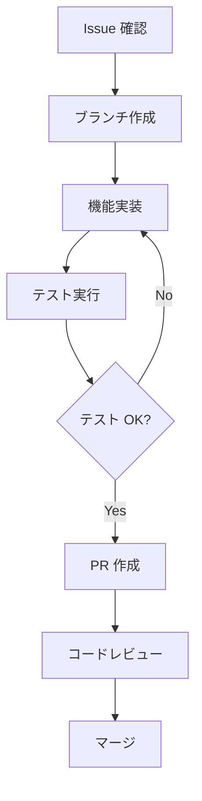

# 👨‍💻 FogueHack 開発者ガイド

## 🎯 はじめに

FogueHackプロジェクトの開発に参加していただき、ありがとうございます！このガイドでは、効率的な開発を行うための情報を提供します。

## 🚀 クイックスタート

### 必要な環境

- **Node.js**: 18.0.0 以上
- **npm**: 9.0.0 以上
- **Git**: 2.30.0 以上
- **VS Code**: (推奨) 最新版

### セットアップ（5分）

```bash
# 1. フォーク & クローン
git clone https://github.com/yourusername/FogueHack.git
cd FogueHack

# 2. 依存関係インストール
npm install

# 3. 開発サーバー起動
npm run dev

# 4. ブラウザでアクセス
# http://localhost:5000
```

### 初回確認

```bash
# TypeScript エラーチェック
npm run check

# Lint 実行
npm run lint

# フォーマット実行
npm run format

# テストコンソール確認
# http://localhost:5000/test-console.html
```

## 📁 プロジェクト構造理解

### 重要なディレクトリ

```
FogueHack/
├── client/src/lib/          # 🎮 ゲームロジック（最重要）
│   ├── gameEngine.ts        # メインエンジン
│   ├── spellSystem.ts       # 魔法システム
│   ├── questSystem.ts       # クエストシステム
│   ├── craftingSystem.ts    # 合成システム
│   └── stores/             # 状態管理
├── client/src/components/   # ⚛️ React コンポーネント
├── server/                  # 🌐 バックエンド
└── docs/                    # 📚 ドキュメント
```

### ファイルの役割

| ファイル | 役割 | 編集頻度 |
|----------|------|----------|
| `gameEngine.ts` | ゲームの中核ロジック | ⭐⭐⭐ |
| `gameTypes.ts` | 型定義 | ⭐⭐⭐ |
| `components/Game.tsx` | メインUI | ⭐⭐ |
| `useGameState.tsx` | 状態管理 | ⭐⭐ |
| `server/routes.ts` | API | ⭐ |

## 🛠️ 開発ワークフロー

### 新機能開発の流れ



### ブランチ戦略

```bash
# 機能追加
git checkout -b feature/issue-123-new-spell

# バグ修正
git checkout -b bugfix/issue-456-combat-bug

# ドキュメント
git checkout -b docs/update-readme

# リファクタリング
git checkout -b refactor/simplify-quest-system
```

### コミットメッセージ規約

```bash
# 形式: type(scope): description

# 機能追加
git commit -m "feat(spell): 新しい雷魔法システムを追加"

# バグ修正
git commit -m "fix(combat): ダメージ計算のオーバーフロー修正"

# ドキュメント
git commit -m "docs(api): API仕様書を更新"

# リファクタリング
git commit -m "refactor(quest): クエスト進行ロジックを簡略化"

# スタイル
git commit -m "style: import文の整理"

# テスト
git commit -m "test: スペルシステムのテスト追加"
```

## 🎮 ゲームシステム開発

### 新しい魔法を追加する

1. **魔法定義を追加**

```typescript
// client/src/lib/spellSystem.ts
const spellData: Spell[] = [
  // ... 既存の魔法
  {
    id: "thunderbolt",
    name: "サンダーボルト",
    type: "offensive",
    manaCost: 30,
    damage: 35,
    range: 6,
    description: "強力な雷撃で敵を攻撃",
    level: 6,
    symbol: "⚡",
    color: "#FFFF00",
    effects: [{ type: "damage", target: "enemy", value: 35 }],
  },
];
```

2. **効果処理を実装**

```typescript
// applySpellEffects メソッド内
case "thunderbolt_effect":
  // 特殊効果があれば実装
  break;
```

3. **日本語メッセージ追加**

```typescript
// client/src/lib/japanese.ts
export const messages = {
  // ...
  youCastThunderbolt: (damage: number) => `サンダーボルトで${damage}ダメージ！`,
};
```

### 新しいクエストタイプを追加する

1. **型定義を追加**

```typescript
// client/src/lib/gameTypes.ts
type QuestType = "kill" | "collect" | "explore" | "craft" | "deliver" | "escort"; // escort を追加

type ObjectiveType = 
  | "kill_monster" 
  | "collect_item" 
  | "reach_floor" 
  | "craft_item" 
  | "use_spell"
  | "escort_npc"; // 新しい目標タイプ
```

2. **クエスト進行処理を追加**

```typescript
// client/src/lib/questSystem.ts
switch (objective.type) {
  // ... 既存のケース
  case "escort_npc":
    shouldUpdate = eventType === "npc_escorted" && objective.target === target;
    break;
}
```

3. **イベント発火を実装**

```typescript
// client/src/lib/gameEngine.ts
// 適切な場所でイベントを発火
const escortMessages = this.questSystem.updateQuestProgress("npc_escorted", npcId);
```

### 新しいアイテムカテゴリを追加する

1. **型定義を更新**

```typescript
// client/src/lib/gameTypes.ts
type ItemType = 
  | "weapon" 
  | "armor" 
  | "potion" 
  | "scroll" 
  | "misc" 
  | "material" 
  | "gem"
  | "tool"; // 新しいカテゴリ
```

2. **アイテム効果を実装**

```typescript
// client/src/lib/gameEngine.ts
useItem(itemId: string): GameState {
  // ...
  if (item.type === "tool") {
    // ツール使用ロジック
  }
}
```

## ⚛️ React 開発

### コンポーネント設計原則

```typescript
// ✅ 良い例: 単一責任の原則
const PlayerStats = ({ player }: { player: Player }) => {
  return (
    <div className="player-stats">
      <div>HP: {player.hp}/{player.maxHp}</div>
      <div>MP: {player.mp}/{player.maxMp}</div>
      <div>Level: {player.level}</div>
    </div>
  );
};

// ❌ 悪い例: 複数の責任
const GameEverything = () => {
  // マップ描画、UI、状態管理すべてを含む
};
```

### パフォーマンス最適化

```typescript
// React.memo で再レンダリング防止
const GameMap = React.memo(({ dungeon, player, monsters }) => {
  // 重い描画処理
}, (prevProps, nextProps) => {
  // カスタム比較関数
  return (
    prevProps.dungeon === nextProps.dungeon &&
    prevProps.player.position === nextProps.player.position
  );
});

// useMemo で計算結果キャッシュ
const visibleMonsters = useMemo(() => {
  return monsters.filter(monster => 
    isVisible(player.position, monster.position)
  );
}, [monsters, player.position]);

// useCallback で関数参照を安定化
const handleKeyPress = useCallback((event: KeyboardEvent) => {
  // キーハンドリング
}, [/* 依存配列 */]);
```

### カスタムフック作成

```typescript
// client/src/hooks/useKeyPress.ts
export const useKeyPress = (targetKey: string, callback: () => void) => {
  useEffect(() => {
    const handler = (event: KeyboardEvent) => {
      if (event.key === targetKey) {
        callback();
      }
    };
    
    window.addEventListener('keydown', handler);
    return () => window.removeEventListener('keydown', handler);
  }, [targetKey, callback]);
};

// 使用例
const Game = () => {
  const { castSpell } = useGameState();
  
  useKeyPress('h', () => castSpell('heal'));
  useKeyPress('f', () => castSpell('fireball'));
  
  return <div>{/* ゲームUI */}</div>;
};
```

## 🎨 UI/UX 開発

### ASCII スタイル維持

```css
/* ASCII 美学のためのスタイル */
.ascii-text {
  font-family: 'Courier New', monospace;
  font-size: 16px;
  line-height: 1.2;
  letter-spacing: 0;
}

.dungeon-tile {
  width: 16px;
  height: 20px;
  display: inline-block;
  text-align: center;
}

/* NetHack スタイルの色使い */
.monster-orc { color: #ffff00; }    /* 黄色 */
.monster-dragon { color: #ff0000; } /* 赤色 */
.item-weapon { color: #cccccc; }    /* 灰色 */
.item-potion { color: #ff69b4; }    /* ピンク */
```

### レスポンシブ対応

```typescript
// client/src/hooks/use-is-mobile.tsx を活用
const GameUI = () => {
  const isMobile = useIsMobile();
  
  return (
    <div className={`game-ui ${
      isMobile ? 'mobile-layout' : 'desktop-layout'
    }`}>
      {/* UI コンテンツ */}
    </div>
  );
};
```

## 🧪 テスト開発

### 現在のテスト環境

```typescript
// client/src/test/gameTest.ts
export function testNewFeature() {
  console.log("=== 新機能テスト開始 ===");
  
  try {
    const gameEngine = new GameEngine();
    gameEngine.startNewGame();
    
    // テストロジック
    const result = gameEngine.someNewMethod();
    
    if (result.success) {
      console.log("✅ 新機能テスト成功");
      return true;
    } else {
      console.log("❌ 新機能テスト失敗:", result.error);
      return false;
    }
  } catch (error) {
    console.error("❌ 新機能テストエラー:", error);
    return false;
  }
}
```

### テスト実行方法

```bash
# 1. 開発サーバー起動
npm run dev

# 2. ブラウザでテストコンソール開く
# http://localhost:5000/test-console.html

# 3. ブラウザコンソールで実行
runGameTests() // 全テスト実行
testNewFeature() // 個別テスト実行
```

### テストの追加

```typescript
// test-game.js に追加
function testCombatSystem() {
  console.log("=== 戦闘システムテスト ===");
  
  const gameEngine = new GameEngine();
  gameEngine.startNewGame();
  
  const initialState = gameEngine.getGameState();
  const initialHp = initialState.player.hp;
  
  // モンスターとの戦闘をシミュレート
  const monster = initialState.monsters[0];
  if (monster) {
    gameEngine.movePlayer(/* モンスターの方向 */);
    const newState = gameEngine.getGameState();
    
    // HP が減少したことを確認
    if (newState.player.hp < initialHp) {
      console.log("✅ 戦闘ダメージ確認");
      return true;
    }
  }
  
  console.log("❌ 戦闘システム異常");
  return false;
}
```

## 🔧 デバッグ技術

### ブラウザ開発者ツール活用

```typescript
// デバッグ用のグローバル関数を追加
if (typeof window !== 'undefined') {
  (window as any).debugGame = {
    getGameState: () => useGameState.getState(),
    setPlayerHp: (hp: number) => {
      const state = useGameState.getState();
      state.player.hp = hp;
    },
    addItem: (itemName: string) => {
      // アイテム追加ロジック
    },
    teleportPlayer: (x: number, y: number) => {
      const state = useGameState.getState();
      state.player.position = { x, y };
    }
  };
}
```

### コンソールでのデバッグ

```javascript
// ブラウザコンソールで実行可能
debugGame.getGameState().player.hp; // HP確認
debugGame.setPlayerHp(1); // HP設定
debugGame.teleportPlayer(10, 10); // テレポート
debugGame.addItem('ruby_sword'); // アイテム追加
```

### ログ出力の活用

```typescript
// 開発時のみログ出力
const DEBUG = process.env.NODE_ENV === 'development';

function debugLog(message: string, data?: any) {
  if (DEBUG) {
    console.log(`🎮 ${message}`, data);
  }
}

// 使用例
castSpell(spellId: string): GameState {
  debugLog('魔法詠唱開始', { spellId, playerMp: this.gameState.player.mp });
  
  const result = this.spellSystem.castSpell(/* ... */);
  
  debugLog('魔法詠唱結果', { success: result.success, message: result.message });
  
  return this.gameState;
}
```

## 📊 パフォーマンス最適化

### React DevTools Profiler

```bash
# React DevTools 拡張機能をインストール
# Chrome: React Developer Tools
# Firefox: React Developer Tools

# Profiler タブで重いコンポーネントを特定
```

### バンドルサイズ分析

```bash
# Bundle analyzer でバンドルサイズ確認
npm install --save-dev webpack-bundle-analyzer

# 分析実行
npm run build
npx webpack-bundle-analyzer dist/public/assets/*.js
```

### メモリリーク対策

```typescript
// useEffect のクリーンアップを忘れずに
useEffect(() => {
  const interval = setInterval(() => {
    // 定期処理
  }, 1000);
  
  return () => clearInterval(interval); // ✅ クリーンアップ
}, []);

// イベントリスナーのクリーンアップ
useEffect(() => {
  const handler = (event: KeyboardEvent) => {
    // キーハンドリング
  };
  
  window.addEventListener('keydown', handler);
  return () => window.removeEventListener('keydown', handler); // ✅ クリーンアップ
}, []);
```

## 🚀 最適な開発環境

### VS Code 推奨設定

```json
// .vscode/settings.json
{
  "typescript.preferences.importModuleSpecifier": "relative",
  "typescript.suggest.autoImports": true,
  "editor.codeActionsOnSave": {
    "source.fixAll.eslint": true,
    "source.organizeImports": true
  },
  "editor.formatOnSave": true,
  "editor.defaultFormatter": "esbenp.prettier-vscode",
  "emmet.includeLanguages": {
    "typescript": "html",
    "typescriptreact": "html"
  }
}
```

### 推奨拡張機能

```json
// .vscode/extensions.json
{
  "recommendations": [
    "esbenp.prettier-vscode",
    "dbaeumer.vscode-eslint",
    "bradlc.vscode-tailwindcss",
    "ms-vscode.vscode-typescript-next",
    "formulahendry.auto-rename-tag",
    "christian-kohler.path-intellisense"
  ]
}
```

### Git フック設定

```bash
# Husky + lint-staged のセットアップ
npm install --save-dev husky lint-staged

# package.json に追加
{
  "husky": {
    "hooks": {
      "pre-commit": "lint-staged"
    }
  },
  "lint-staged": {
    "*.{ts,tsx}": [
      "eslint --fix",
      "prettier --write"
    ]
  }
}
```

## 🆘 よくある問題と解決法

### TypeScript エラー

```bash
# 型エラーの確認
npm run check

# よくあるエラーと解決法
# 1. Property does not exist on type
# → 型定義を確認、インターフェースを更新

# 2. Cannot find module
# → import パスを確認、alias 設定を確認

# 3. Type 'any' is not assignable
# → 適切な型を定義
```

### パフォーマンス問題

```typescript
// React DevTools Profiler で重いコンポーネントを特定
// 以下の最適化を検討:

// 1. React.memo の使用
const HeavyComponent = React.memo(({ data }) => {
  // 重い処理
});

// 2. useMemo でコスト高い計算をキャッシュ
const expensiveValue = useMemo(() => {
  return heavyCalculation(data);
}, [data]);

// 3. useCallback で関数参照を安定化
const memoizedCallback = useCallback(() => {
  doSomething(a, b);
}, [a, b]);
```

### ゲームバランス調整

```typescript
// client/src/lib/gameEngine.ts でバランス調整

// ダメージ計算式
const damage = Math.max(1, 
  attacker.attack - defender.defense + 
  Math.floor(Math.random() * 5) // ランダム要素
);

// 経験値テーブル調整
const expToNext = player.level * 100; // リニア成長
// または
const expToNext = Math.pow(player.level, 1.5) * 100; // 指数的成長

// アイテムドロップ率調整
const dropChance = 0.3; // 30%
if (Math.random() < dropChance) {
  // アイテムドロップ
}
```

## 📚 学習リソース

### 必読ドキュメント

- [React 公式ドキュメント](https://react.dev/)
- [TypeScript ハンドブック](https://www.typescriptlang.org/docs/)
- [Zustand ドキュメント](https://github.com/pmndrs/zustand)
- [Tailwind CSS](https://tailwindcss.com/docs)
- [NetHack Wiki](https://nethackwiki.com/) - ゲームデザイン参考

### 推奨記事

- [React パフォーマンス最適化](https://react.dev/learn/render-and-commit)
- [TypeScript ベストプラクティス](https://typescript-jp.gitbook.io/deep-dive/)
- [ゲーム開発パターン](http://gameprogrammingpatterns.com/)

## 🤝 コミュニティ

### コミュニケーション

- **GitHub Discussions**: 一般的な質問・提案
- **GitHub Issues**: バグ報告・機能リクエスト
- **Pull Request**: コードレビュー・議論

### 貢献の仕方

1. **コード貢献**: バグ修正、新機能実装
2. **ドキュメント**: README、ガイド更新
3. **テスト**: テストケース追加
4. **デザイン**: UI/UX 改善
5. **翻訳**: 他言語対応（将来）

### レビュー観点

- **機能性**: 仕様通りに動作するか
- **パフォーマンス**: 重くないか
- **保守性**: 読みやすいコードか
- **テスト**: 適切にテストされているか
- **ドキュメント**: ドキュメントは更新されているか

---

**Happy Coding!** 🎮⚔️

何か質問があれば、遠慮なく GitHub Issues や Discussions で聞いてください！
